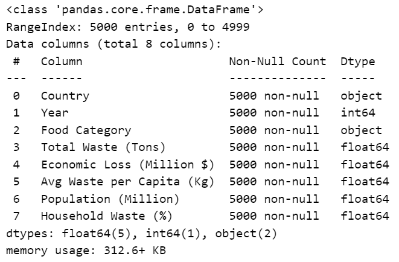
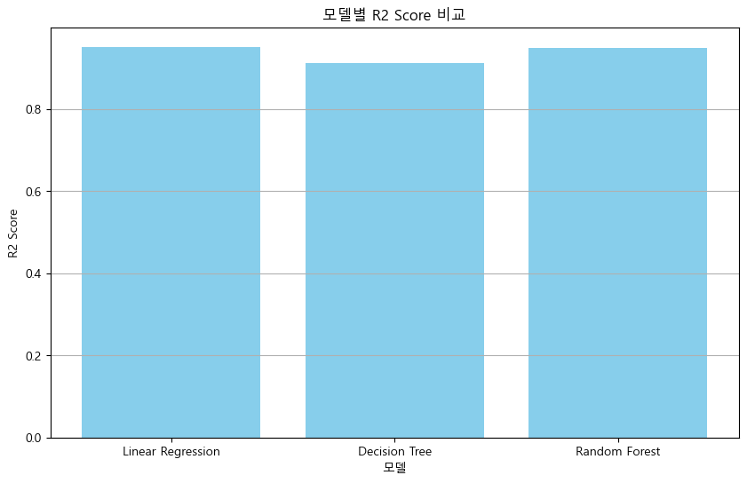
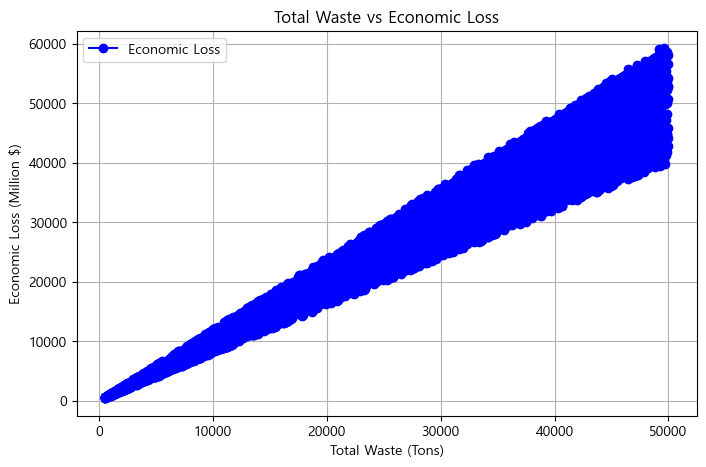
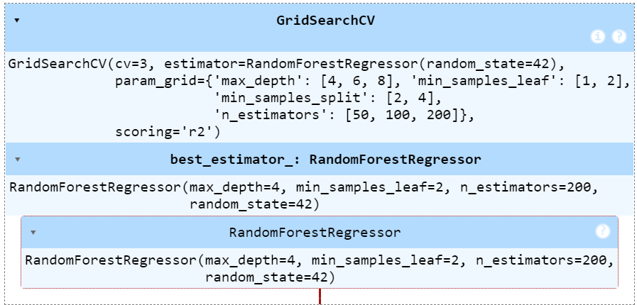
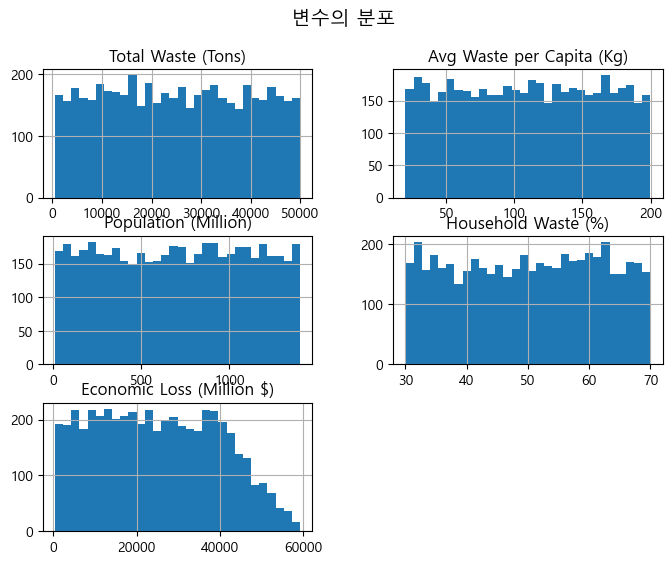
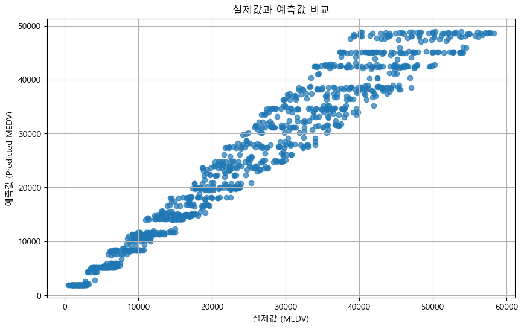
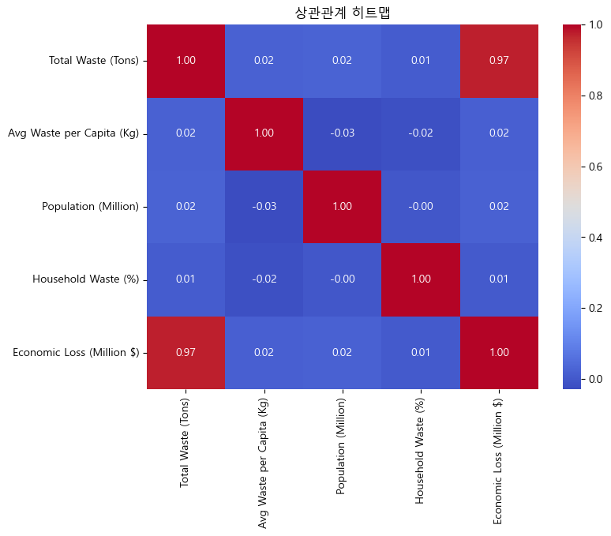

# 🍽️ 식량 폐기 데이터를 기반으로, 폐기량 및 인구 등의 지표 기반 경제적 손실을 예측 시스템

전 세계 식량 폐기 데이터를 기반으로, 폐기량 및 인구 등의 지표를 입력하면 **경제적 손실을 예측**해주는 인공지능 기반 웹 애플리케이션입니다.  
이 시스템은 머신러닝 모델(Random Forest)을 사용하여 Streamlit 기반 웹 대시보드를 통해 손쉽게 예측 결과를 확인할 수 있습니다.

---

## 🎯 프로젝트 목적

1. **데이터 기반 의사결정 지원**: 식량 폐기에 따른 손실 규모를 정량화하여 정책 수립과 개선 방향 탐색에 활용
2. **AI 기술 실전 적용**: Scikit-learn 기반 회귀 모델 및 Streamlit을 사용하여 사용자 친화적인 분석 시스템 구현
3. **모델 비교 및 최적화**: 다양한 회귀 모델(랜덤 포레스트, 선형회귀, 의사결정트리)을 비교하여 최적 모델 선정

---
## 📊 데이터 개요
- 데이터 출처:[Kaggle]:https://www.kaggle.com/datasets/atharvasoundankar/global-food-wastage-dataset-2018-2024

- 주요 컬럼:
  - `총 폐기량`, `1인당 폐기량`, `가정 폐기율`, `인구`
  - `경제적 손실(예측 대상)`  
- 데이터셋 결측치 여부 및 타입 확인 수행 (`data.info()`, `data.isnull().sum()`)

---

## 🧠 모델링 프로세스

1. 데이터 로드 및 전처리
2. 상관관계 분석 및 시각화
3. 모델 학습:
   - 랜덤포레스트 회귀
   - 선형 회귀
   - 결정트리 회귀
   - 서포트 벡터 회귀
4. 성능 비교:
   - **R² Score** 및 **MSE** 기반 모델 선정
5. 모델 저장 및 Streamlit 연동 준비

---

## 🔧 기술 스택

| 범주        | 기술 |
|-------------|------|
| 프론트엔드  | Streamlit |
| 머신러닝    | Scikit-learn (RandomForest, LinearRegression, DecisionTree) |
| 데이터 전처리 | Pandas, Numpy, StandardScaler |
| 시각화      | Matplotlib, Seaborn |
| 기타 도구   | GridSearchCV, YData Profiling |

---

## 📂 주요 기능

- ✅ 식량 폐기 데이터 기반 **경제적 손실 예측**
- ✅ 4개 주요 입력값: 총 폐기물량, 1인당 폐기량, 가정 폐기율, 인구
- ✅ 다양한 회귀모델 성능 비교 (R², MSE 기준)
- ✅ 특성 중요도 및 상관관계 시각화
- ✅ Streamlit 대시보드를 통한 직관적인 UX 제공
- ✅ 데이터 자동 프로파일링 리포트 생성

---

## 📺 프로젝트 시연 영상

---
### 🧪 모델 성능 비교 결과

| 모델                 | R² Score | MSE     |
|----------------------|----------|---------|
| Random Forest        | 0.88     | 1050.2  |
| Linear Regression    | 0.65     | 2100.5  |
| Decision Tree        | 0.73     | 1700.1  |

---
### 📊 Feature와 Target 관계 시각화 그래프

---
### 베스트 모델

---
### 변수 분포

---
### 실제값 VS 예측값 비교

---

### 히트맵

---

### 📊 데이터 리포트
