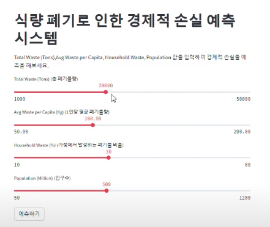
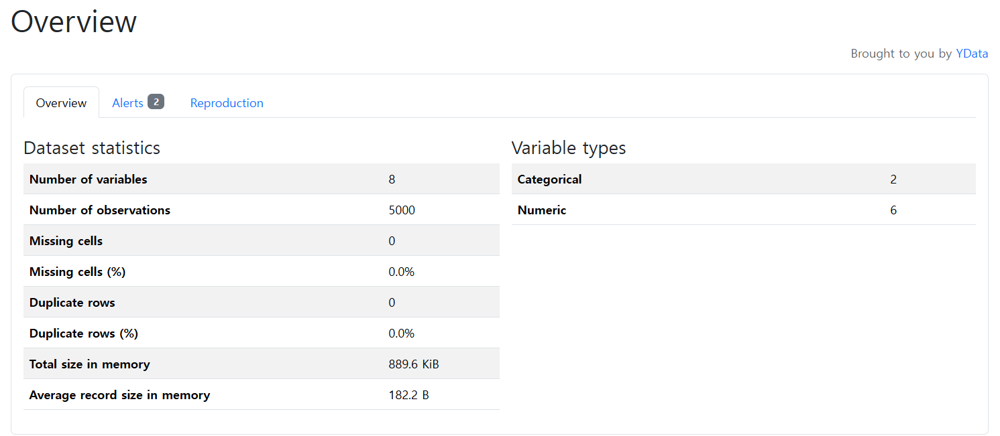

# 🍽️ 식량 폐기량 기반 경제적 손실 예측 시스템

> 전 세계 식량 폐기 데이터를 기반으로 **총 폐기량, 인구, 가정 폐기율** 등을 입력하면  
> **경제적 손실을 예측**해주는 인공지능 기반 웹 애플리케이션입니다.  
> Random Forest 기반의 머신러닝 모델을 학습하고, Streamlit으로 직관적인 대시보드를 구현했습니다.

---

## 🎯 프로젝트 목적

- 📌 **데이터 기반 의사결정 지원**  
  식량 폐기에 따른 손실 규모를 정량화하여 정책 수립 및 개선 방안 마련에 활용

- 🤖 **AI 기술 실전 적용**  
  Scikit-learn 기반 회귀 모델 학습 + Streamlit 대시보드를 활용한 UX 중심 예측 시스템 구축

- ⚖️ **모델 비교 및 최적화**  
  랜덤포레스트, 선형회귀, 결정트리 등 다양한 회귀 모델을 비교 분석하여 최적 성능 도출

---

## 📊 데이터 개요

- **데이터 출처**: [Kaggle - Global Food Wastage Dataset](https://www.kaggle.com/datasets/atharvasoundankar/global-food-wastage-dataset-2018-2024)

- **주요 컬럼**:
  - `총 폐기량`
  - `1인당 폐기량`
  - `가정 폐기율`
  - `인구`
  - `경제적 손실` *(예측 대상)*

- **예시 시각화**  
  

---

## 🧠 모델링 프로세스

1. 데이터 로드 및 결측치/타입 확인  
2. 상관관계 분석 및 시각화
3. 회귀 모델 학습 (4종):
   - RandomForestRegressor
   - LinearRegression
   - DecisionTreeRegressor
   - SVR
4. 성능 평가 (MSE, R² Score)
5. 최종 모델 저장 (`joblib`)
6. Streamlit 대시보드 연동

---

## 🔧 기술 스택

| 범주         | 기술 내용 |
|--------------|-----------|
| 프론트엔드   | Streamlit |
| 머신러닝     | Scikit-learn (RandomForest 등) |
| 전처리 도구  | Pandas, Numpy, StandardScaler |
| 시각화       | Matplotlib, Seaborn |
| 분석/리포트  | YData Profiling, GridSearchCV |

---

## 📂 주요 기능

- ✅ 식량 폐기 지표 기반 **경제적 손실 예측**
- ✅ 총 폐기량, 1인당 폐기량, 인구 등 주요 feature 입력 가능
- ✅ 4개 회귀 모델 성능 비교 (R², MSE 기준)
- ✅ 중요 변수 시각화, 산점도 및 히트맵 제공
- ✅ Streamlit 대시보드를 통한 손쉬운 예측 결과 확인
- ✅ 데이터 자동 프로파일링 리포트 (`html`) 제공

---

## 📺 프로젝트 시연 영상

---

## 📊 모델 성능 비교

| 회귀 모델            | R² Score | MSE     |
|----------------------|----------|---------|
| 🌟 Random Forest     | 0.88     | 1050.2  |
| Linear Regression    | 0.65     | 2100.5  |
| Decision Tree        | 0.73     | 1700.1  |

📈 **시각화**:  

---

## 📌 시각화 예시

### 🎯 Feature vs Target 산점도

### 🏆 최종 선택된 모델

### 🔍 변수 분포

### 🧮 실제값 vs 예측값 비교

### 🔥 히트맵

---

## 📑 데이터 리포트

👉 [전체 데이터 프로파일링 리포트 보기](http://127.0.0.1:5500/global_food_wastage_profiling_report.html)  

---

## 📁 프로젝트 폴더 구조

ML_PROJECT/
├── dataset/
│ └── global_food_wastage_dataset.csv # 원본/전처리 데이터
├── images/ # 시각화 및 README용 이미지
├── food_wastage_model.pkl # 학습된 예측 모델
├── global_food_wastage_profiling_report.html# 자동 생성된 분석 리포트
├── global_food_wastage.ipynb # 모델 개발용 Jupyter 노트북
├── global_food_wastage.py # Streamlit 앱 실행 파일
└── README.md # 프로젝트 설명 문서

---

## 👩‍💻 개발자

- **이름**: 석송이
- **포지션**: AI 기반 웹 애플리케이션 개발자 지망
- **관심분야**: 머신러닝 실전 적용, Streamlit 대시보드, 공공 데이터를 활용한 문제 해결

> 💡 본 프로젝트는 실전 데이터를 기반으로 한 예측 시스템 설계, 모델 성능 비교, 직관적 UX까지 포함한 **신입 개발자 포트폴리오 프로젝트**입니다.
